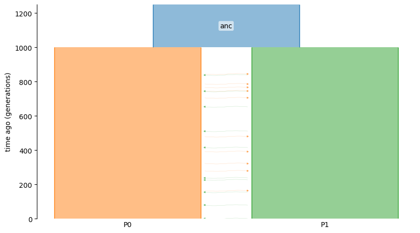
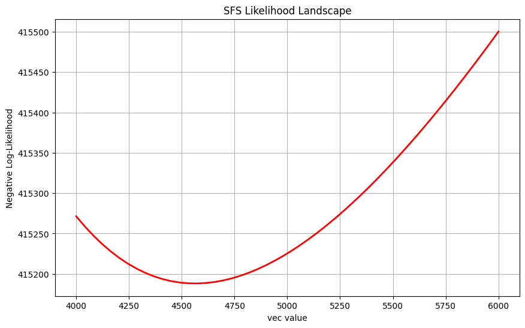
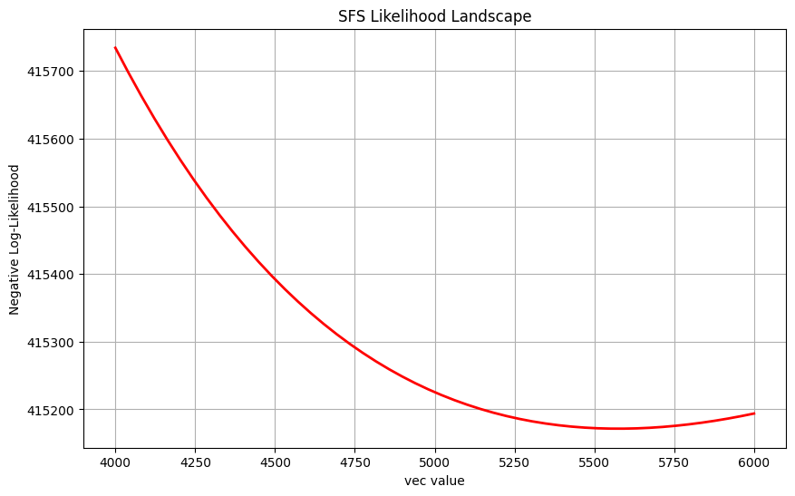
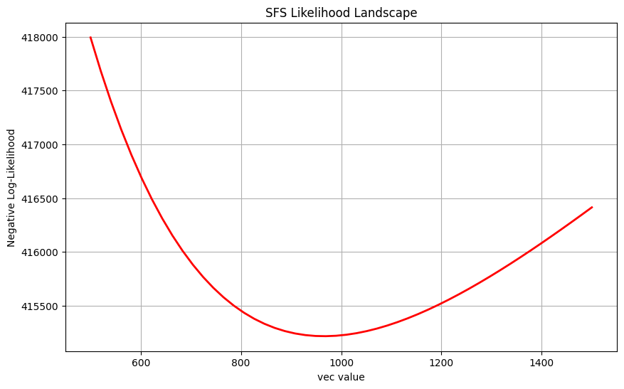
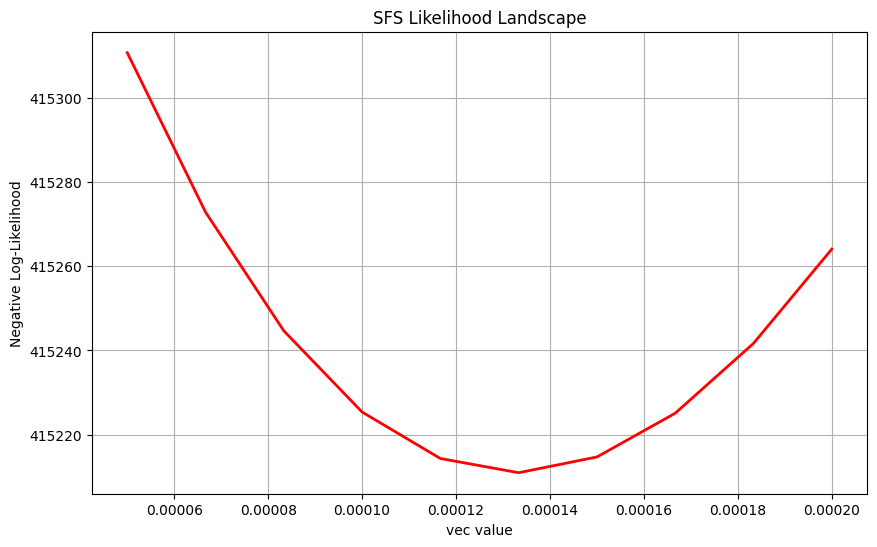

Tutorial
========

This tutorial demonstrates how to use the ``momi3`` module (part of the ``demesinfer`` package) to perform demographic inference on population models. 

In momi3, the main approach for demographic inference is based on the site frequency spectrum (SFS) of genetic data.

The corresponding Jupyter notebook for this tutorial is available at ``docs/tutorial.ipynb``.

We will walk through simulating a population structure, running inference using the SFS, and interpreting the results.  

Simulation
----------

We begin by simulating genetic data under a simple demographic model using the ``msprime`` and ``demes`` packages.

To get started, import the necessary packages:

.. code-block:: python

    import msprime as msp
    import demes
    import demesdraw

For simplicity, we model two subpopulations (``P0`` and ``P1``) that split from a common ancestor.
We assume all populations have constant effective population sizes of 5000, and the subpopulations exchange migrants at a symmetric migration rate of 0.0001.

.. code-block:: python

    demo = msp.Demography()
    demo.add_population(initial_size=5000, name="anc")
    demo.add_population(initial_size=5000, name="P0")
    demo.add_population(initial_size=5000, name="P1")
    demo.set_symmetric_migration_rate(populations=("P0", "P1"), rate=0.0001)
    tmp = [f"P{i}" for i in range(2)]

We set the split time between the subpopulations and their ancestor to 1000 generations:

.. code-block:: python

    demo.add_population_split(time=1000, derived=tmp, ancestral="anc")

We can visualize the demographic model using ``demesdraw``:

.. code-block:: python

    g = demo.to_demes()
    demesdraw.tubes(g)

Next, we simulate the ancestry of 20 individuals sampled from the two subpopulations using ``msprime.sim_ancestry()``.  
We use a mutation and recombination rate of 1e-8 and a sequence length of 10 million base pairs, with fixed random seeds for reproducibility.

.. code-block:: python

    sample_size = 10
    samples = {f"P{i}": sample_size for i in range(2)}
    anc = msp.sim_ancestry(samples=samples, demography=demo,
                           recombination_rate=1e-8,
                           sequence_length=1e8,
                           random_seed=12)
    ts = msp.sim_mutations(anc, rate=1e-8, random_seed=13)

Lastly, we compute the allele frequency spectrum (AFS) from the simulated data:

.. code-block:: python

    afs_samples = {f"P{i}": sample_size*2 for i in range(2)}
    afs = ts.allele_frequency_spectrum(
        sample_sets=[ts.samples([1]), ts.samples([2])],
        span_normalise=False,
    )

For more details regarding the construction of demographic models using msprime.Demography(), please refer to: https://tskit.dev/msprime/docs/stable/demography.html

Demographic parameters in momi3
-------------------------------

A convenient feature of momi3 is its treatment of demographic model parameterization. It automatically translates a given demographic model (e.g., IWM, exponential growth, stepping stone, population split with migration) into the precise set of numerical constraints that satisfy model restrictions, such as those governing time intervals, population sizes, and admixture events. This eliminates the tedious and challenging manual derivation of constraints, making constrained optimization both more accessible.

To see all parameters associated to this model:

.. code-block:: python

    from demesinfer.constr import constraints_for, EventTree
    et = EventTree(g)
    et.variables

In this specific example, any parameters within the same ``frozenset`` object are treated as a single parameter, which implicitly constrains them all to be equal. The first three frozenset objects represent the constant population sizes for anc, P0, and P1, respectively. Because the population size is constant over the epoch, the start and end size are treated as a single parameter. 

('migrations', 0, 'rate') and ('migrations', 1, 'rate') are the respective assymetric migration parameters between populations P0 and P1.

The last two frozenset objects constrain the timing of events. Following the construction of the model, the start times of subpopulation and migration events must always match the end time of the ancestral population. The last ``frozenset`` constrains the end time of subpopulations and migrations to align together.

Demographic constraints in momi3
-------------------------------
Suppose you were interested in inferring 3 parameters - the ancestral population size, rate of migration from P0 to P1, and the time of divergence. To output the associated linear constraints:

.. code-block:: python

    constraints_for(et, *[frozenset({('demes', 0, 'epochs', 0, 'end_size'),
            ('demes', 0, 'epochs', 0, 'start_size')}), ('migrations', 0, 'rate'), frozenset({('demes', 0, 'epochs', 0, 'end_time'),
            ('demes', 1, 'start_time'),
            ('demes', 2, 'start_time'),
            ('migrations', 0, 'start_time'),
            ('migrations', 1, 'start_time')})])

We see the ``eq`` and ``ineq`` sets associated to A, b, A', b' for the linear equality and inequality constraints (Ax = b, A'x <= b'). The constraint ordering is identical to the ordering of the input list. In this specific example, the ancestral population size must be nonnegative, migration rate stays within the bounds [0, 1], and time of divergence is nonnegative.

To do: Mention to people that by default migration is asymmetric. Show people how they can add in their own custom constraints. For example, show how do we edit the output of constraints_for to ensure that the migration rates are symmetric.

The ``constraints_for`` function outputs the linear constraints required for optimizing a select set of parameters. During this process, any parameters not explicitly selected remain fixed at their initial values, ensuring the core model structure is preserved.

Inference using SFS-based methods in momi3
------------------------------------------

To do: Write up an example that literally just outputs the loglik value as well as its gradient for any parameter just to show people how to call on it. Then we can proceed to plot the likelihoods and whatnot.

Now we demonstrate how to use momi3 to perform demographic inference from the simulated SFS.

We will infer three types of parameters: population sizes, split times, and migration rates.

**Note**: Inference with large sample sizes may be slow. Consider reducing the number of samples when running locally.

To visually inspect how the likelihood changes (and assess reliability), we define a helper function to plot the results:

.. code-block:: python

    from jax import vmap, lax

    def plot_sfs_likelihood(demo, paths, vec_values,
                            afs, afs_samples,
                            theta=None, sequence_length=None):
        import matplotlib.pyplot as plt

        path_order: List[Var] = list(paths)
        esfs = ExpectedSFS(demo, num_samples=afs_samples)

        def sfs_loglik(afs, esfs, sequence_length, theta):
            afs = afs.flatten()[1:-1]
            esfs = esfs.flatten()[1:-1]
            
            if theta:
                assert sequence_length
                tmp = esfs * sequence_length * theta
                return jnp.sum(-tmp + xlogy(afs, tmp))
            else:
                return jnp.sum(xlogy(afs, esfs / esfs.sum()))
        
        def evaluate_at_vec(vec):
            vec_array = jnp.atleast_1d(vec)
            params = _vec_to_dict_jax(vec_array, path_order)
            e1 = esfs(params)
            return -sfs_loglik(afs, e1, sequence_length, theta)

        results = lax.map(evaluate_at_vec, vec_values)

        plt.figure(figsize=(10, 6))
        plt.plot(vec_values, results, 'r-', linewidth=2)
        plt.xlabel("Parameter value")
        plt.ylabel("Negative Log-Likelihood")
        plt.title("SFS Likelihood Landscape")
        plt.grid(True)
        plt.show()

        return results

Estimating the ancestral population size
----------------------------------------

We first infer the size of the ancestral population ``anc``.  
With an initial guess of 4000, we evaluate the likelihood over a grid of values from 4000 to 6000:

.. code-block:: python

    import jax.numpy as jnp
    paths = {
        frozenset({
            ("demes", 0, "epochs", 0, "end_size"),
            ("demes", 0, "epochs", 0, "start_size"),
        }): 4000.,
    }
    vec_values = jnp.linspace(4000, 6000, 50)
    result = plot_sfs_likelihood(g, paths, vec_values, afs, afs_samples)

The negative log-likelihood is minimized around 4600, close to the true value of 5000.

Estimating the descendant population size
-----------------------------------------

Next, we infer the size of descendant population ``P0``.  
Again, starting from 4000, we search over values between 4000 and 6000:

.. code-block:: python

    import jax.numpy as jnp
    paths = {
        frozenset({
            ("demes", 1, "epochs", 0, "end_size"),
            ("demes", 1, "epochs", 0, "start_size"),
        }): 4000.,
    }
    vec_values = jnp.linspace(4000, 6000, 50)
    result = plot_sfs_likelihood(g, paths, vec_values, afs, afs_samples)

Here, the negative log-likelihood is minimized around 5500, close to the true value of 5000.

Estimating the split time
-------------------------

We then infer the split time between the ancestral population and its two descendants.  
This parameter is shared across multiple paths (two deme start times, one epoch end time, and two migration start times):

.. code-block:: python

    import jax.numpy as jnp
    paths = {
        frozenset({
            ("demes", 0, "epochs", 0, "end_time"),
            ("demes", 1, "start_time"),
            ("demes", 2, "start_time"),
            ("migrations", 0, "start_time"),
            ("migrations", 1, "start_time"),
        }): 4000.,
    }
    vec_values = jnp.linspace(500, 1500, 50)
    result = plot_sfs_likelihood(g, paths, vec_values, afs, afs_samples)

The negative log-likelihood is minimized around 1000, correctly recovering the split time.

Estimating the migration rate
-----------------------------

Finally, we infer the migration rate between the two descendant populations:

.. code-block:: python

    import jax.numpy as jnp
    paths = {
        ("migrations", 0, "rate"): 0.0001,
    }

    vec_values = jnp.linspace(0.00005, 0.0002, 10)
    result = plot_sfs_likelihood(g, paths, vec_values, afs, afs_samples)

The negative log-likelihood is minimized around 0.00013, close to the true value of 0.0001.

Population size change example
==========================================
To do: I will leave this simulation example here. We will just show people what the constraints_for looks like and how to interpret it. The user can do figure out how to do optimization themselves. Do not try to simulate this code, it takes like 10+ minutes to run. 

.. code-block:: python
    import msprime as msp
    import demes
    import demesdraw
    import numpy as np

    # Create demography object
    demo = msp.Demography()

    # Add populations
    demo.add_population(initial_size=4000, name="anc")
    demo.add_population(initial_size=500, name="P0", growth_rate=-np.log(3000 / 500)/66)
    demo.add_population(initial_size=500, name="P1", growth_rate=-np.log(3000 / 500)/66)
    demo.add_population(initial_size=100, name="P2", growth_rate=-np.log(3000 / 100)/66)

    # Set initial migration rate
    demo.set_symmetric_migration_rate(populations=("P0", "P1"), rate=0.0001)
    demo.set_symmetric_migration_rate(populations=("P1", "P2"), rate=0.0001)

    # population growth at 500 generations
    demo.add_population_parameters_change(
        time=65,
        initial_size=3000,  # Bottleneck: reduce to 1000 individuals
        population="P0",
        growth_rate=0
    )
    demo.add_population_parameters_change(
        time=65,
        initial_size=3000,  # Bottleneck: reduce to 1000 individuals
        population="P1",
        growth_rate=0
    )
    demo.add_population_parameters_change(
        time=66,
        initial_size=3000,  # Bottleneck: reduce to 1000 individuals
        population="P2",
        growth_rate=0
    )

    # Migration rate change changed to 0.001 AFTER 500 generation (going into the past)
    demo.add_migration_rate_change(
        time=66,
        rate=0.0005, 
        source="P0",
        dest="P1"
    )
    demo.add_migration_rate_change(
        time=66,
        rate=0.0005, 
        source="P1",
        dest="P0"
    )
    demo.add_migration_rate_change(
        time=66,
        rate=0.0005, 
        source="P1",
        dest="P2"
    )
    demo.add_migration_rate_change(
        time=66,
        rate=0.0005, 
        source="P2",
        dest="P1"
    )

    # THEN add the older events (population split at 1000)
    demo.add_population_split(time=5000, derived=["P0", "P1", "P2"], ancestral="anc")

    # Visualize the demography
    g = demo.to_demes()
    demesdraw.tubes(g, log_time=True)

To do: explain that one of the times being 65 generations was very intentional in order to split off variables from the same frozenset object. 

.. code-block:: python
    from demesinfer.constr import constraints_for, EventTree
    demo = g
    et = EventTree(demo)
    et.variables
